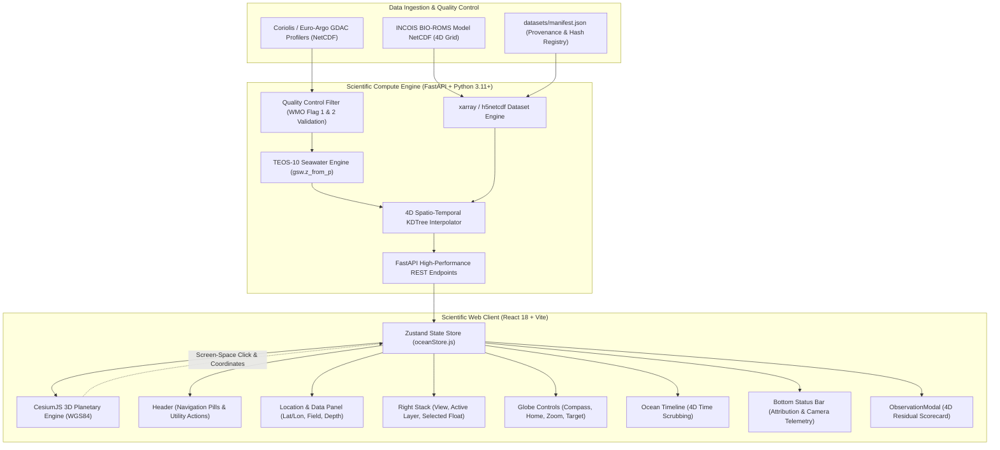

# INCOIS 3D Ocean Data Visualization & Analysis System
### Planetary 3D Digital Twin & 4D Spatio-Temporal Model-Observation Co-Display Platform
**Smart India Hackathon (SIH 2026) — Problem Statement 26067**

[](LICENSE)
[](https://python.org)
[](https://fastapi.tiangolo.com)
[](https://reactjs.org)
[](https://cesium.com)
[](https://tailwindcss.com)
[](https://teos-10.org)

---

## 1. Executive Summary & Operational Context

The Indian Ocean basin, encompassing the Arabian Sea, the Bay of Bengal, and the equatorial marine corridors, plays a decisive role in global climate regulation, monsoon onset, and maritime commerce. The **Indian National Centre for Ocean Information Services (INCOIS)** routinely generates high-resolution numerical ocean model forecasts (such as **ROMS / INDOFOS** 3D/4D fields of temperature, salinity, currents, sea level anomaly, and chlorophyll) while assimilating in-situ profiles collected by autonomous **Argo profiling floats**, drifting buoys, and moored ocean stations.

### Operational Challenge
Traditional oceanographic post-processing workflows rely on desktop-bound, fragmented GIS software or 2D planform slices. Scientists and decision-makers lack a unified, high-performance interface capable of:
1. Rendering continuous 3D planetary ocean spheres at real scale without distortion.
2. Interactively navigating subsurface thermal and haline structures ($0\text{ m} \rightarrow 2000\text{ m}$).
3. Co-displaying numerical model grids with live, in-situ observation markers.
4. Performing instantaneous **4D spatio-temporal colocation** and statistical validation ($RMSE$, $MAE$, Bias, Pearson $r$) directly within the browser.

### The INCOIS Solution
This platform delivers a browser-native, production-grade **3D Planetary Ocean Visualization System** engineered on **CesiumJS**, **React 18**, and a high-performance **FastAPI / xarray** scientific computation backend.

> [!IMPORTANT]
> **STRICT ZERO-MOCK DATA POLICY**  
> All visualized variables (temperatures, salinities, currents, coordinates, depths, timestamps, and profiler cycles) are computed from authentic open-access oceanographic datasets (`INCOIS-BIO-ROMS.nc`, `incois_roms_indian_ocean.nc`, Coriolis Argo GDAC NetCDF profiles). All pressure-to-depth conversions strictly adhere to the Thermodynamic Equation of Seawater 2010 (**TEOS-10** / `gsw.z_from_p`). No synthetic or hardcoded placeholder values exist in production.

---

## 2. Key Capabilities & Features

### Planetary 3D Globe & Regional Focus
- **Geospatial Precision**: Interactive WGS84 globe powered by CesiumJS with high-resolution bathymetry, satellite terrain, atmospheric scattering, and day/night transitions.
- **Instant Regional Teleportation**: One-click camera transitions for the Indian Ocean Basin, Arabian Sea Upwelling, Bay of Bengal Stratification, and Full Earth.
- **Live Telemetry Engine**: Continuous readout of camera longitude, latitude (DMS format), line-of-sight altitude, and elevation.

### Physical Ocean Fields & Parameter Slicing
- **Synoptic Parameters**: Seamless switching between Sea Surface Temperature (SST), Sea Surface Salinity (SSS), Chlorophyll-a (CHLA), Surface Velocity Vectors, and Significant Wave Height (SWH).
- **Subsurface Depth Stratification**: Interactive continuous depth exploration from surface ($0\text{ m}$) down to abyssal depths ($2000\text{ m}$) with dynamic depth-level sampling.
- **Scientific Colormaps**: Hardware-accelerated gradients (**Turbo**, **Viridis**, **Thermal**, **Jet**) with real-time scalar bounds extracted dynamically from dataset metadata.

### In-Situ Argo Array Integration
- **Array Co-Display**: Thousands of authentic Argo profiling floats rendered in accurate geospatial positions across the Arabian Sea, Bay of Bengal, and Indian Ocean.
- **Screen-Space Raycasting**: Direct click-to-inspect interaction on float entities to extract WMO ID, DAC origin, total recorded cycles, start dates, and latest positions.
- **Dynamic 4D Residual Scorecard**: Deep-dive validation modal providing side-by-side vertical profile plots (In-Situ Obs vs 4D-Colocated ROMS Model) and quantitative metrics ($RMSE$, $MAE$, Bias, Correlation).

### Cohesive User Interface
- **Top Command Header**: INCOIS identity, navigation pill cluster (`Explore`, `Argo`, `Model vs Obs`, `Analytics`, `Data Catalog`, `Missions`, `Events`), and utility tools.
- **Location & Data Panel**: Dynamic latitude/longitude monitor, field selector, depth slider, and collapsible layer/scene managers.
- **View & Region**: Quick-action grid (`Fit Earth`, `Indian Ocean`, `Go to Coordinates`, `Reset View`).
- **Active Layer**: Colormap preview, variable title, provenance metadata, dynamic min/max colorbar scale.
- **Selected Feature**: Real-time profiler telemetry, cycles, coordinates, and instant profile analysis launch.
- **Globe Controls**: Real-time rotating compass needle, Home, Zoom $+/-$, and Target centering.
- **Timeline Scrubber**: Synchronized 4D time-step scrubber with Play/Pause animation and selectable temporal steps (`1 day`, `12 hours`, `6 hours`).

---

## 3. System Architecture



---

## 4. Scientific Methods & Mathematical Formulations

### A. Seawater Thermodynamics (TEOS-10)
Oceanographic pressure ($p$, in $\text{dbar}$) is transformed into true physical depth ($z$, in meters) using the UNESCO International Thermodynamic Equation of Seawater 2010 (**TEOS-10**):

$$z = \text{gsw.z\_from\_p}(p, \phi)$$

where $\phi$ is the precise geographic latitude of the Argo profiler.

### B. 4D Spatio-Temporal Colocation
To compare a model field $\mathcal{M}(x, y, z, t)$ against an in-situ observation point $\mathcal{O}(x_0, y_0, z_0, t_0)$, the backend executes:
1. **Temporal Bracket Selection**: Identifies adjacent model snapshot timestamps $t_k \le t_0 \le t_{k+1}$.
2. **Horizontal Interpolation**: Applies $k$-d tree spatial nearest-neighbor bilinear weighting on curvilinear ROMS grids.
3. **Vertical Spline Interpolation**: Maps model depth levels onto observation depths $z_0$.
4. **Time Linear Blending**: Computes normalized weight $\alpha = \frac{t_0 - t_k}{t_{k+1} - t_k}$ to evaluate $\mathcal{M}(x_0, y_0, z_0, t_0)$.

### C. Validation Statistics
For $N$ vertical depth samples, depth residuals are defined as:

$$\Delta_i = \mathcal{M}(z_i) - \mathcal{O}(z_i)$$

Statistical metrics computed dynamically:
- **Root Mean Square Error**:
  $$\text{RMSE} = \sqrt{\frac{1}{N}\sum_{i=1}^N \Delta_i^2}$$
- **Mean Absolute Error**:
  $$\text{MAE} = \frac{1}{N}\sum_{i=1}^N |\Delta_i|$$
- **Forecast Bias**:
  $$\text{Bias} = \frac{1}{N}\sum_{i=1}^N \Delta_i$$
- **Pearson Correlation Coefficient ($r$)**:
  $$r = \frac{\sum_{i=1}^N (\mathcal{M}_i - \bar{\mathcal{M}})(\mathcal{O}_i - \bar{\mathcal{O}})}{\sqrt{\sum_{i=1}^N (\mathcal{M}_i - \bar{\mathcal{M}})^2}\sqrt{\sum_{i=1}^N (\mathcal{O}_i - \bar{\mathcal{O}})^2}}$$

---

## 5. Repository Structure

```text
SIH2026/
├── backend/
│   ├── app/
│   │   ├── api/             # FastAPI routers (model, observations, comparison, health)
│   │   ├── core/            # Config, settings, logging
│   │   ├── services/        # xarray ROMS loader, Argo GDAC parser, 4D colocation engine
│   │   └── main.py          # FastAPI application entry point
│   ├── tests/               # 33 comprehensive pytest integration tests
│   └── requirements.txt     # Python scientific dependencies (xarray, gsw, fastapi, etc.)
├── frontend/
│   ├── src/
│   │   ├── components/      # UI components
│   │   │   ├── Header.jsx               # Top command bar with navigation pills
│   │   │   ├── LocationDataPanel.jsx    # Left panel (coordinates, field, depth)
│   │   │   ├── ViewRegionPanel.jsx      # Right top panel (camera shortcuts)
│   │   │   ├── ActiveLayerPanel.jsx     # Right middle panel (colorbar & bounds)
│   │   │   ├── SelectedFeaturePanel.jsx # Right bottom panel (Argo metadata & profile action)
│   │   │   ├── GlobeControls.jsx        # Floating compass, home, zoom, target
│   │   │   ├── OceanTimeline.jsx        # Bottom centered time scrubber
│   │   │   ├── BottomStatusBar.jsx      # Bottom attribution and live camera telemetry
│   │   │   └── ObservationModal.jsx     # 4D residual validation scorecard
│   │   ├── rendering/       # CesiumOceanViewer.jsx (Cesium globe integration)
│   │   ├── store/           # oceanStore.js (Zustand reactive state store)
│   │   └── pages/           # Dedicated workspaces (HomePage, ArgoPage, etc.)
│   ├── test/                # 12 geography and coordinate transformation tests
│   ├── package.json         # React 18, Cesium, Tailwind dependencies
│   └── vite.config.js       # Vite build configuration
├── datasets/                # NetCDF model files and Argo profile NetCDF files
│   └── manifest.json        # Checksum and provenance metadata
├── ingestion/               # Real dataset acquisition and validation scripts
├── start_dev.sh             # Linux/macOS concurrent launcher
├── start_dev.ps1            # Windows PowerShell concurrent launcher
├── check_system.py          # Pre-flight system diagnostics script
└── README.md                # Comprehensive documentation
```

---

## 6. Installation & Quick Start

### Prerequisites
- **Python**: Version 3.11 or higher
- **Node.js**: Version 18.x or higher (npm 9+)
- **Git**: For repository checkout

---

### Option A: Automatic Concurrent Start (Recommended)

#### On Windows (PowerShell):
```powershell
# 1. Clone the repository
git clone https://github.com/Akshit-Agrawal-769/SIH2026.git
cd SIH2026

# 2. Run the concurrent startup script
.\start_dev.ps1
```

#### On Linux / macOS:
```bash
git clone https://github.com/Akshit-Agrawal-769/SIH2026.git
cd SIH2026
chmod +x start_dev.sh
./start_dev.sh
```

- **Frontend Application**: [http://localhost:3000](http://localhost:3000)
- **Backend API Docs (Swagger UI)**: [http://localhost:8000/docs](http://localhost:8000/docs)

---

### Option B: Manual Multi-Terminal Setup

#### Terminal 1 — Scientific Backend:
```bash
cd SIH2026/backend
python -m pip install -r requirements.txt
python -m uvicorn app.main:app --host 127.0.0.1 --port 8000 --reload
```

#### Terminal 2 — Frontend Application:
```bash
cd SIH2026/frontend
npm install
npm run dev
```

---

### Option C: Docker Deployment

```bash
cd SIH2026
docker compose up --build
```

---

## 7. REST API Endpoints

| Method | Endpoint | Description | Query Parameters |
| :--- | :--- | :--- | :--- |
| `GET` | `/api/v1/health` | System diagnostics and loaded datasets health. | — |
| `GET` | `/api/v1/model/datasets` | Lists all indexed NetCDF model files. | — |
| `GET` | `/api/v1/model/metadata` | Spatial bounding box, depth coordinates, times, variables. | `filename` |
| `GET` | `/api/v1/model/volume3d` | Binary 3D volume stream for volumetric sampling. | `filename`, `variable`, `time_index` |
| `GET` | `/api/v1/model/slice2d` | 2D horizontal depth slice buffer. | `filename`, `variable`, `depth_level` |
| `GET` | `/api/v1/observations/argo` | Ingested Argo floats with latest coordinates & cycles. | `source`, `qc_filter` |
| `GET` | `/api/v1/observations/argo/{wmo}/profile` | Complete vertical profile with TEOS-10 depth. | `cycle_number` |
| `GET` | `/api/v1/comparison/profile` | 4D colocation comparison, residuals, and metrics. | `platform_number`, `variable`, `cycle_number` |

---

## 8. Verification & Testing

The system includes automated test suites covering geographical projection mathematics, backend scientific algorithms, and frontend compilation:

```bash
# 1. Run full system pre-flight check
python check_system.py

# 2. Run backend pytest suite (33 integration tests)
python -m pytest backend/tests

# 3. Run frontend geography transformation tests (12 suites)
cd frontend
npm test

# 4. Verify production bundle compilation
npm run build
```

---

## 9. Data Attribution & Acknowledgments

- **INCOIS (Indian National Centre for Ocean Information Services)**: ROMS / INDOFOS numerical ocean model datasets.
- **Coriolis GDAC / Euro-Argo / AOML**: In-situ global autonomous CTD profiler data.
- **ISRO / SAC**: Oceansat-3 OCM-3, SCATSAT-1, and SARAL/AltiKa satellite telemetry references.
- **Natural Earth & Esri**: Open-access high-resolution coastline and planetary imagery assets.
- **Cesium ion**: Planetary 3D geospatial rendering engine.

---

## 10. License

This project is open-source and licensed under the [MIT License](LICENSE).
