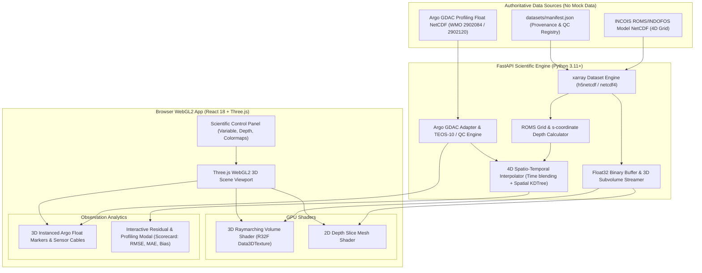

# INCOIS Web-Based 3D Ocean Data Visualization System
### Integrated 3D Volumetric Ocean Model Rendering & In-Situ Observation Co-Display Platform
**Smart India Hackathon (SIH 2026) — Problem Statement 26067**

[](LICENSE)
[](https://python.org)
[](https://fastapi.tiangolo.com)
[](https://reactjs.org)
[](https://threejs.org)

---

## 1. Problem Statement & Operational Context

India's vast Exclusive Economic Zone (EEZ) and coastline demand continuous, high-resolution monitoring of ocean state variables. **INCOIS (Indian National Centre for Ocean Information Services)** routinely generates and archives large volumes of numerical ocean model outputs (such as **ROMS / INDOFOS** 3D/4D fields of temperature, salinity, currents $u, v, w$, and chlorophyll) alongside in-situ observations from autonomous **Argo profiling floats** and underwater **Gliders**.

Despite the richness of this data, traditional tools are desktop-bound, support only 2D plan views, or lack the ability to co-visualize numerical model outputs alongside in-situ instrument profiles.

### The Solution
A browser-native, high-performance **3D Ocean Data Visualization Platform** that combines numerical ocean model fields (ROMS / INDOFOS) with real in-situ observations (Argo profiling floats) in a unified interactive 3D WebGL2 scene, complete with 4D spatio-temporal colocation and statistical model validation metrics.

> [!IMPORTANT]
> **STRICT NO MOCK DATA POLICY**  
> This platform strictly ingests and processes real oceanographic datasets. No fake temperatures, hardcoded coordinates, or synthetic float paths exist in production. Pressure-to-depth conversions are calculated using the thermodynamic equation of seawater (**TEOS-10** / `gsw.z_from_p`). See [DATA_POLICY.md](DATA_POLICY.md) and [SCIENTIFIC_METHODS.md](SCIENTIFIC_METHODS.md) for details.

---

## 2. Core Capabilities & Architecture

### Implemented Capabilities:
- **3D Volumetric Raymarching**: Custom WebGL2 GLSL fragment shaders for direct raymarching of 3D scalar ocean volumes (`Data3DTexture`) with step-size integration and transfer functions.
- **Scientific Colormaps**: Real-time switching between standard palettes (**Turbo**, **Viridis**, **Thermal**, **Jet**).
- **Interactive 2D Depth Slicing**: Dynamic depth plane elevation control ($0\text{m} \rightarrow 2000\text{m}$) to inspect horizontal slices at arbitrary ocean levels.
- **Iso-Surface Extraction**: Real-time 3D iso-surface threshold rendering for oceanographic fronts and thermoclines.
- **In-Situ Argo Co-Display**: 3D instanced Argo float markers placed at authentic geographic coordinates (Arabian Sea & Bay of Bengal) with interactive raycasting click inspection.
- **4D Spatio-Temporal Colocation**: Model fields interpolated in 4D space-time $(x, y, z, t)$ across bounding model forecast steps $(t_0, t_1)$ onto in-situ float positions and timestamps.
- **Statistical Model-vs-Obs Validation Scorecard**:
  - Depth-resolved residuals: $\Delta(z) = \text{Model}(z) - \text{Obs}(z)$
  - Root Mean Square Error (RMSE)
  - Mean Absolute Error (MAE)
  - Forecast Bias
  - Pearson Correlation Coefficient ($r$)
- **Quality Control (QC) Filtering**: Automatic parsing and rejection of bad or uncalibrated measurements ($QC \notin \{1, 2\}$).
- **Native ROMS $s$-Coordinate Support**: Computes physical depth $z(x,y,s,t)$ for ROMS terrain-following vertical grids.
- **Timeline Playback**: Automated 4D time-step animation with play/pause and step controls.

---

## 3. System Architecture



---

## 4. Quick Start & How to Run

### Method 1: Single-Command Launch (Recommended)

```bash
# Clone the repository
git clone https://github.com/Akshit-Agrawal-769/SIH2026.git
cd SIH2026

# Launch backend (port 8000) and frontend (port 3000) concurrently
./start_dev.sh
```

- Open **`http://localhost:3000`** in your browser.
- Interactive API Documentation: **`http://localhost:8000/docs`**.

---

### Method 2: Manual Multi-Terminal Setup

#### Terminal 1 — Start Scientific Backend:
```bash
cd SIH2026/backend
pip install -r requirements.txt
uvicorn app.main:app --reload --host 0.0.0.0 --port 8000
```

#### Terminal 2 — Start WebGL Frontend:
```bash
cd SIH2026/frontend
npm install
npm run dev
```

---

### Method 3: Docker Compose

```bash
cd SIH2026
docker-compose up --build
```

---

## 5. Dataset Ingestion & Validation

To verify the authentic datasets against the manifest and run TEOS-10 validation:

```bash
# 1. Fetch authentic open-access Indian Ocean Argo floats and verify manifest
python3 ingestion/fetch_real_datasets.py

# 2. Run real data validator and TEOS-10 conversion check
python3 ingestion/validate_real_data.py
```

---

## 6. System Diagnostics & Automated Testing

Run the full system health check and automated test suite:

```bash
# 1. Run system diagnostics
python3 check_system.py

# 2. Run backend API & scientific computation tests
cd backend
python3 -m pytest tests/
```

---

## 7. REST API Reference

| Method | Endpoint | Description |
| :--- | :--- | :--- |
| `GET` | `/api/v1/health` | Checks status of loaded real NetCDF datasets. |
| `GET` | `/api/v1/model/datasets` | Lists available ROMS/INDOFOS model NetCDF files. |
| `GET` | `/api/v1/model/metadata?filename=...` | Returns spatial bounds, depth levels, time range, and variable info. |
| `GET` | `/api/v1/model/volume3d?filename=...&variable=temp` | Streams normalized Float32 binary 3D volume buffer for WebGL `Data3DTexture`. |
| `GET` | `/api/v1/model/slice2d?filename=...&variable=temp` | Streams 2D Float32 binary depth slice buffer. |
| `GET` | `/api/v1/observations/argo` | Lists ingested Argo floats with trajectories and positions. |
| `GET` | `/api/v1/observations/argo/{wmo}/profile` | Returns full vertical profile measurements with TEOS-10 depths and QC flags. |
| `GET` | `/api/v1/comparison/profile?platform_number=...` | Returns 4D interpolated model vs obs comparison, residuals, and metrics (RMSE, MAE, Bias, $r$). |

---

## 8. License & Documentation

- [LICENSE (MIT)](LICENSE)
- [SCIENTIFIC_METHODS.md](SCIENTIFIC_METHODS.md)
- [DATA_POLICY.md](DATA_POLICY.md)
- [datasets/manifest.json](datasets/manifest.json)
