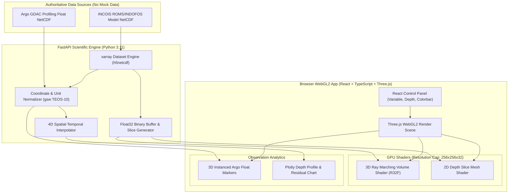

# INCOIS Web-Based 3D Ocean Data Visualization System
### Integrated 3D Volumetric Ocean Model Rendering & In-Situ Observation Co-Display Platform

[](LICENSE)
[](https://python.org)
[](https://fastapi.tiangolo.com)
[](https://reactjs.org)
[](https://typescriptlang.org)
[](https://threejs.org)

---

## 1. Problem Statement & Operational Context

India's vast Exclusive Economic Zone (EEZ) and coastline demand continuous, high-resolution monitoring of ocean state variables. **INCOIS (Indian National Centre for Ocean Information Services)** routinely generates and archives large volumes of ocean model outputs—including three-dimensional fields of temperature, salinity, current vectors ($u, v, w$), chlorophyll, etc.—as well as real-time and delayed-mode observations from autonomous instruments such as **Argo profiling floats** and underwater **Gliders**.

Despite the richness of this data, traditional tools are desktop-bound, support only 2D plan views, or lack the ability to co-visualize model outputs alongside instrument profiles. Operational oceanographers are forced to toggle between disparate software packages, hindering rapid hazard assessment, search-and-rescue advisories, fishery management, and climate monitoring.

### The Solution
A browser-native, high-performance **3D Ocean Data Visualization System** that integrates numerical ocean model fields (ROMS / INDOFOS) with in-situ observations (Argo floats, Gliders) in a unified interactive 3D WebGL environment.

---

## 2. Acronyms & Authoritative Datasets Reference

### Table 1: Acronyms

| Acronym | Full Form | Description / Operational Role |
| :--- | :--- | :--- |
| **INCOIS** | Indian National Centre for Ocean Information Services | Primary provider of ocean state forecasts, advisories, and data services under MoES, Govt. of India. |
| **EEZ** | Exclusive Economic Zone | Sea zone up to 200 nautical miles over which India has special rights for marine resource management. |
| **ROMS** | Regional Ocean Modeling System | Free-surface, terrain-following, primitive-equation ocean model used for hydrodynamics. |
| **INDOFOS** | Indian Ocean Forecasting System | Operational ocean forecast framework maintained by INCOIS for physical and biological variables. |
| **CF Conventions** | Climate and Forecast Metadata Conventions | Standardizing metadata defining oceanographic and atmospheric variables in NetCDF files. |
| **OGC** | Open Geospatial Consortium | International standards organization defining geospatial web service specifications (WMS, WCS). |
| **OPeNDAP** | Open-source Project for a Network Data Access Protocol | High-performance remote data streaming protocol allowing remote array subsetting over HTTP. |
| **ERDDAP** | Environmental Research Division's Data Access Server | Unified data server facilitating access to scientific datasets (NetCDF, OPeNDAP, REST APIs). |
| **BGC** | Biogeochemical | Sensors measuring biological/chemical variables (Chlorophyll-a, Dissolved Oxygen, pH, Nitrate). |
| **CTD** | Conductivity, Temperature, Depth | Primary oceanographic probe measuring physical properties across the water column. |
| **TEOS-10 / GSW** | International Thermodynamic Equation of Seawater | Standard thermodynamic library for oceanographic unit conversions (e.g., pressure $\text{dbar} \rightarrow$ depth $\text{m}$). |
| **RMSE / MAE** | Root Mean Square Error / Mean Absolute Error | Statistical metrics quantifying discrepancy between numerical ocean forecasts and in-situ observations. |

---

### Table 2: Authoritative Real Oceanographic Datasets

| Dataset Name | Authoritative Source | Protocol / Access Mechanism | Standard Format & Schema | Primary Variables |
| :--- | :--- | :--- | :--- | :--- |
| **INCOIS Regional Ocean Model (ROMS/INDOFOS)** | INCOIS Data Center / ERDDAP ([erddap.incois.gov.in](https://erddap.incois.gov.in/)) | OPeNDAP, REST API, NetCDF-4 Direct Files | NetCDF-4 (CF-1.6), 3D/4D Curvilinear grid | `temp`, `salt`, `u`, `v`, `w`, `chl` across `time`, `s_rho`, `eta_rho`, `xi_rho` |
| **Indian Ocean Argo Profiling Floats** | INCOIS Argo Data Center / Ifremer GDAC ([ftp.ifremer.fr/ifremer/argo](ftp://ftp.ifremer.fr/ifremer/argo)) | OPeNDAP, ERDDAP TableDAP, FTP/HTTP | NetCDF-4 Profile (Argo Manual v3.2) | `TEMP`, `PSAL`, `PRES`, `TEMP_QC`, `PSAL_QC` across `N_PROF`, `N_LEVELS` |
| **Indian Ocean Glider Profiles** | Ocean Gliders DAC / IMOS / INCOIS Glider Facility | ERDDAP TableDAP, NetCDF-OGD | NetCDF-4 Trajectory/Profile (EGO Standard) | `TEMP`, `PSAL`, `DENSITY`, `CHLA` across time-series trajectory |
| **In-Situ CTD / Moored Buoy Data** | INCOIS Digital Ocean Portal ([do.incois.gov.in](https://do.incois.gov.in/)) | REST API, OGC WMS/WCS, CSV/NetCDF | NetCDF-4 / Delimited ASCII | `surface_temp`, `salinity`, `current_speed`, `current_dir` |

> [!IMPORTANT]
> **NO MOCK DATA POLICY**  
> This platform strictly ingests real oceanographic datasets. No fake temperatures, hardcoded coordinates, or synthetic float paths exist in production. If a dataset endpoint is unreachable, the system explicitly reports `REAL DATASET REQUIRED - [DATASET_ID] UNAVAILABLE AT SOURCE`.

---

## 3. Core System Architecture



---

## 4. Repository Structure

```
SIH2026/
├── frontend/                       # React 18 + TypeScript + Three.js WebGL App
│   ├── public/                     # Static assets & map textures
│   ├── src/
│   │   ├── components/             # React UI controls, timelines, Plotly modals
│   │   ├── rendering/              # Three.js viewport, volume raymarcher, shaders
│   │   ├── services/               # API client & Float32 binary array decoders
│   │   ├── store/                  # Zustand state management
│   │   └── types/                  # TypeScript interface definitions
│   ├── package.json
│   ├── tsconfig.json
│   └── vite.config.ts
├── backend/                        # FastAPI Scientific Data Gateway
│   ├── app/
│   │   ├── api/                    # REST endpoints (/model, /observations, /comparison)
│   │   ├── core/                   # Server configuration & CORS settings
│   │   ├── services/               # xarray slicing & TEOS-10 unit conversion
│   │   ├── schemas/                # Pydantic data schemas
│   │   └── main.py                 # FastAPI application entrypoint
│   ├── requirements.txt
│   └── Dockerfile
├── ingestion/                      # Scientific Data Ingestion & Validation Pipeline
│   ├── validate_real_data.py       # REAL DATA VALIDATION SCRIPT (Milestone 1)
│   ├── adapters/                   # ROMS NetCDF & Argo NetCDF adapters
│   └── requirements.txt
├── datasets/                       # Real NetCDF Data Storage Directory
│   ├── model/                      # Real INCOIS ROMS NetCDF files
│   ├── argo/                       # Real Argo profile NetCDF files
│   └── README.md                   # Real dataset instructions & no-mock-data rules
├── docker-compose.yml              # Local & INCOIS Infrastructure Deployment
├── .gitignore                      # Python, Node, NetCDF & Zarr ignore rules
└── README.md                       # Project documentation
```

---

## 5. Getting Started & Local Setup

### Prerequisites
- **Python**: 3.11+
- **Node.js**: 18+ / npm 9+
- **Docker & Docker Compose** (Optional, for containerized run)

### Option A: Docker Compose (Recommended)

```bash
# Clone the repository
git clone https://github.com/Akshit-Agrawal-769/SIH2026.git
cd SIH2026

# Start backend and frontend services
docker-compose up --build
```
Access the Web UI at `http://localhost:3000` and API docs at `http://localhost:8000/docs`.

---

### Option B: Manual Local Setup

#### 1. Ingestion & Scientific Backend Setup
```bash
cd backend
python -m venv venv
# On Windows:
venv\Scripts\activate
# On Linux/macOS:
source venv/bin/activate

pip install -r requirements.txt
uvicorn app.main:app --reload --port 8000
```

#### 2. Frontend WebGL App Setup
```bash
cd frontend
npm install
npm run dev
```

---

## 6. Team Details

**Team Name:** CodeVengers

**Team Members:**
- **Member 1** - Technical Lead / Architect
- **Member 2** - Scientific Computing / Python Lead
- **Member 3** - WebGL / 3D Graphics Engineer
- **Member 4** - Full Stack Developer
- **Member 5** - Geospatial Engineer
- **Member 6** - UI/UX & Data Visualization Specialist

---

## 7. License
This project is licensed under the MIT License. See [LICENSE](LICENSE) for details.
