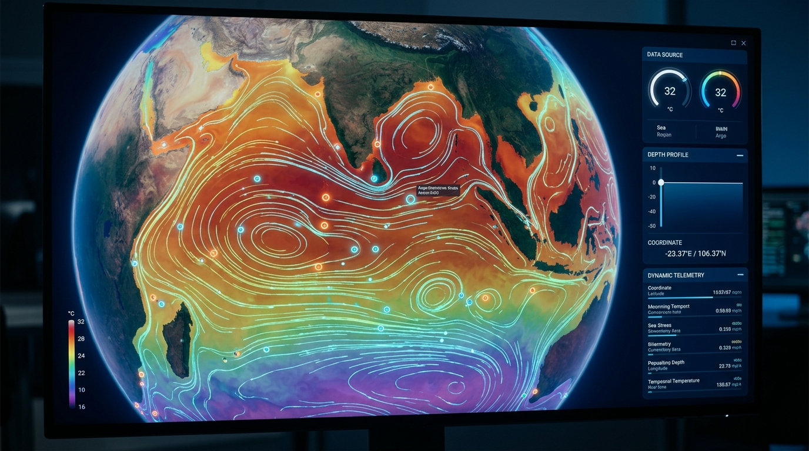
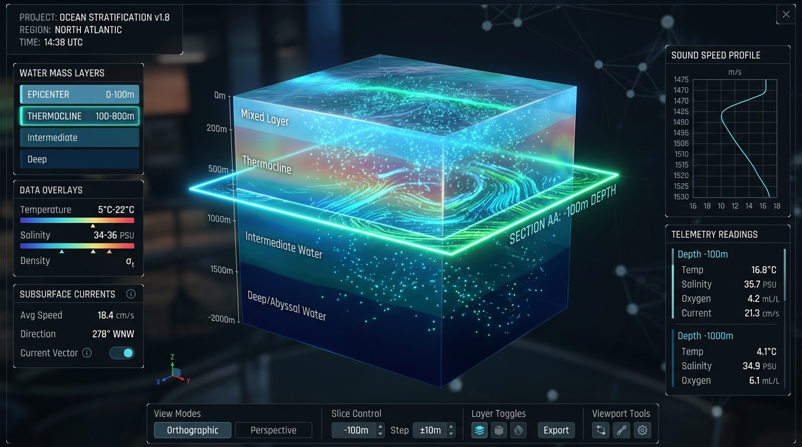
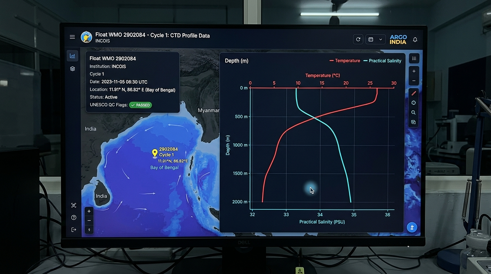

# Project Screenshots & Visualizer Previews

This directory contains visual captures of the INCOIS 3D Ocean Data Visualization Platform demonstrating key scientific workflows, 3D graphics, and in-situ observation analysis.

---

## Screenshot Catalog

### 1. Global Geospatial Ocean Context (`01-cesium-3d-globe.png`)

*Full-globe interactive 3D virtual globe powered by CesiumJS. Shows authentic CMEMS Sea Surface Temperature (°C) draped over the Indian Ocean, equatorial current vector streamlines, day-night sun terminator, and real-time Argo profiling float stations.*

---

### 2. 3D Volumetric Water Column Block Studio (`02-volumetric-cube-studio.png`)

*Three.js volumetric inspection modal displaying an extracted 3D ocean block from the sea surface (0m) down to the abyssal basin (-2000m). Features an interactive laser depth scan plane, subsurface current flow particles, and physical water mass stratification.*

---

### 3. In-Situ Argo CTD Profile Inspector (`03-argo-profile-inspector.png`)

*Interactive vertical CTD depth profile chart for INCOIS Argo Float 2902084 in the Bay of Bengal. Displays authentic temperature and salinity curves across 97 depth soundings with strict UNESCO QC flag filtering.*

---

### 4. Oceanographic Telemetry & Depth-Slice Controls (`04-depth-slice-hud.png`)

*Scientific control panel displaying real-time depth-level readings (temperature, salinity, sound velocity via Mackenzie equation), dynamic colormap customization (NOAA SST, Turbo, Viridis, GFDL Chlorophyll), and depth slider navigation.*

---

## Naming Conventions
When updating screenshots:
- `01-cesium-3d-globe.png` — Macro-scale 3D globe view with draped field
- `02-volumetric-cube-studio.png` — Micro-scale 3D volumetric water column
- `03-argo-profile-inspector.png` — In-situ sensor profile charts
- `04-depth-slice-hud.png` — Depth controls & oceanographic telemetry
